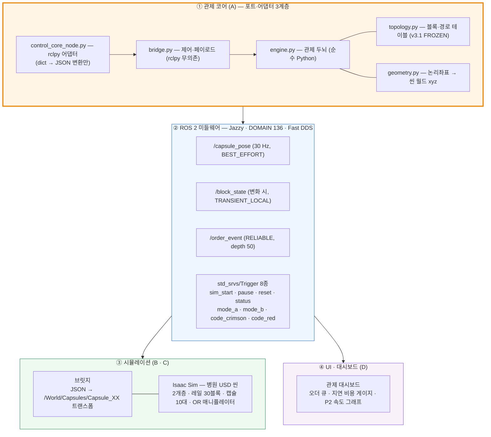
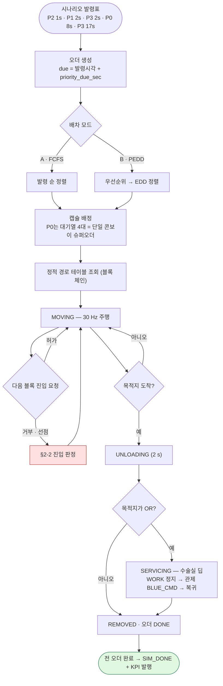
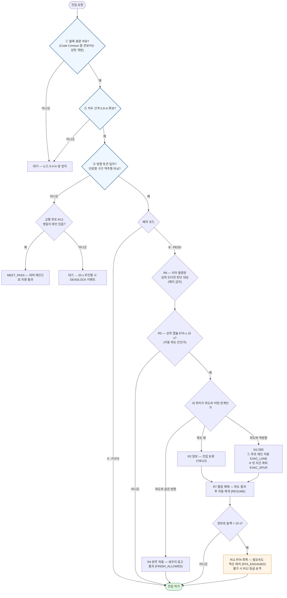
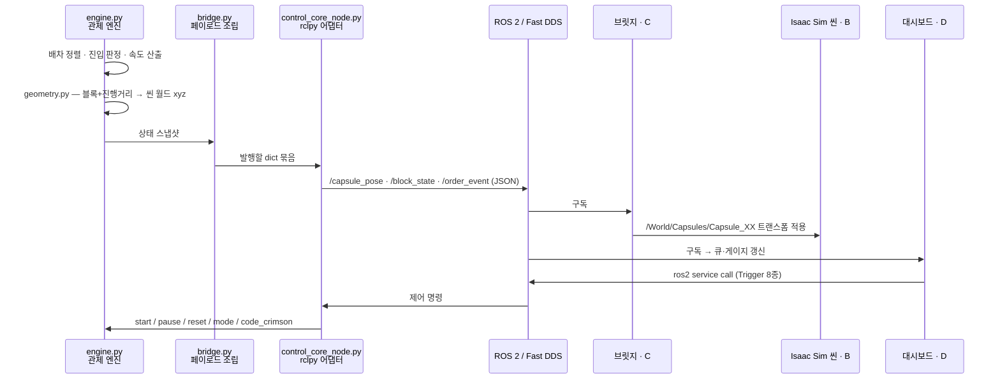

# 의료 레일 관제 디지털 트윈

병원 지하 1층 · 지상 2층을 잇는 **전용 레일 물류망**을 Isaac Sim 디지털 트윈으로 구축하고,
그 위에서 **우선순위 선점(P-EDD) 관제 알고리즘**을 실행·검증하는 프로젝트입니다.

핵심 시연은 **Code Crimson(대량수혈 프로토콜)** 입니다. 선착순(FCFS) 배차에서 꼴찌로 밀렸던
응급 혈액 콘보이 4대를 선점 배차가 앞으로 끌어올리고, 그 대가로 지연된 화물은 시스템이
스스로 가속해 마감 내 회복시킵니다.

| 오더 | 모드 A (FCFS) | 모드 B (선점+RTA) | 해석 |
|---|---|---|---|
| **P0 혈액 콘보이 4대 → OR2** | 70.77 s | **67.07 s** | **−5.2 %**, 꼴찌 탈출 |
| P1 응급약품 | 37.60 s | 37.60 s | 동률 — 완주 허용으로 손해 0 |
| P2 항암제 | 48.97 s | 76.47 s | 양보 비용 → RTA 회복으로 마감 78 s에 1.53 s 여유 정시 |
| P3 멸균 공급 | 36.17 s | 36.17 s | 동률 — 콘보이와 동방향이라 무간섭 |
| P3 사용 기구 회수 | 74.97 s | 86.77 s | 대피 비용 |

> 수치 출처: [`docs/관제_기술문서.md`](docs/관제_기술문서.md) §5 · 회귀 기준값 `config/params.yaml` `baseline`.
> 30 Hz 결정론 시뮬레이션이며 ±0.2 s를 벗어나면 회귀 테스트가 실패합니다.

---

## 1. 시스템 설계

### 1-1. 4대 PC 구성

| 파트 | 담당 | 역할 | 산출물 |
|---|---|---|---|
| **A. 관제 코어** | 남현지 | 배차·경로·교통제어·긴급대응 판단, 위치 진실 소스 | `src/rail_control_core/` |
| **B. 씬 빌더** | 한석형 | 병원 USD 씬, 레일·캡슐·매니퓰레이터 자산, 카메라 | `isaacpjt/`, `isaacsim/` |
| **C. 연동** | 정희진 | ROS 2 ↔ Isaac Sim 브릿지, 통합 디버깅 | `src/rail_bridge/`, `isaacpjt/scripts/` |
| **D. UI·QA** | 김세은 | 관제 대시보드, 품질 검증 | `src/medical-rail-twin/` |

4대 모두 하나의 유선 스위치(`10.10.0.1~4`), 하나의 ROS 도메인(`136`), 하나의 FastDDS
화이트리스트를 공유합니다.

### 1-2. 계층 구조



**설계 원칙 — 판단은 코어에, ROS는 어댑터에.**
`bridge.py`는 rclpy를 임포트하지 않습니다. 노드가 30 Hz로 `bridge.step()`을 호출하면 발행할
dict 묶음을 돌려주고, 노드는 그것을 JSON으로 바꿔 뿌리기만 합니다. 덕분에 **ROS 없이 전 로직을
테스트**할 수 있고, 통합 장애가 나면 "테스트 통과 여부"로 관제 책임과 ROS 경계 책임을 즉시 가릅니다.

**위치의 진실 소스는 관제 코어입니다.** 캡슐의 블록 ID·진행거리·방향은 물론 **씬 월드 좌표 x/y/z까지
코어가 계산해서 발행**하고, 씬과 UI는 구독만 합니다. 브릿지는 받은 좌표를 프림 트랜스폼에 그대로 꽂습니다.

### 1-3. 알고리즘 5계층

| 계층 | 채택 | 탈락 대안과 이유 |
|---|---|---|
| ① 배차 | **P-EDD** (우선순위 → EDD) + 콘보이 슈퍼오더 | 단순 FIFO — 응급 역전 불가 |
| ② 경로 | 정적 경로 테이블 | WHCA\*/CBS — 트리형 토폴로지라 경로가 유일, 탐색할 것이 없음 |
| ③ 교통 제어 | **철도식 폐색** — 블록 상호배제 + 차두간격 + 방향 토큰 + 단방향 + 교행 루프(R13) | 은행원 알고리즘 — 더 복잡하면서 이 구조에선 이득 없음 |
| ④ 긴급 대응 | **ETA 이동 파도(bow-wave) 선점** + 3분기 스윕 + 롤링 해제 | 전 경로 일괄 잠금 — 원거리 하위 오더까지 과잉 지연 |
| ⑤ 속도 | **RTA 슬랙 회복**(R11) + 회복 불가 시 P2→P1 **자동 승격**(R12) | 단순 비례식 — 여유 0으로 수렴 / MPC — 30블록 MVP엔 과설계 |

### 1-4. 3-FSM

| FSM | 상태 |
|---|---|
| **오더** | CREATED → EN_ROUTE → ARRIVED → DONE |
| **캡슐** | DOCKED/QUEUED/STANDBY → MOVING ↔ YIELD_WAIT/EVACUATED/FINISHING → UNLOADING → (OR이면 SERVICING) → REMOVED |
| **블록** | FREE / RESERVED / OCCUPIED |

---

## 2. 플로우 차트

### 2-1. 오더 생애주기



### 2-2. 블록 진입 판정 — 안전망이 항상 먼저



파란 박스 ①②③이 **R8 안전망**이며 **모드 A·B 양쪽에서 항상 먼저** 검사됩니다.
그래서 선착순 모드는 *느릴 뿐 위험하지 않습니다* — 충돌·교착 방지는 배차 정책과 무관합니다.

### 2-3. 데이터 흐름 (1틱 = 1/30 초)



---

## 3. 운영체제 · 실행 환경

`src/rail_control_core/tools/setup_env.sh` 에 고정된 **팀 확정값**입니다. 4대 전원이 동일해야
하며, 하나라도 다르면 **그 PC만 조용히 통신이 안 됩니다.**

| 항목 | 값 |
|---|---|
| OS | **Ubuntu 24.04 LTS (Noble)** |
| ROS 2 | **Jazzy Jalisco** |
| Python | **3.12** (Jazzy 기본) |
| RMW | **`rmw_fastrtps_cpp`** (eProsima Fast DDS) |
| `ROS_DOMAIN_ID` | **136** |
| FastDDS 프로파일 | `~/.ros/fastdds_whitelist.xml` — `127.0.0.1` + `10.10.0.1~4` 인터페이스 화이트리스트 |
| 유선 대역 | `10.10.0.0/24` (조원 번호 = 마지막 옥텟) |
| 방화벽 | `ufw` 비활성화 |
| 빌드 | `colcon` (ament_python) |
| 시뮬레이터 | NVIDIA **Isaac Sim** (`omni.usd` · `omni.kit.app` · `omni.replicator.core` · `pxr` API 사용) |

> ⚠️ Isaac Sim·NVIDIA 드라이버·CUDA의 **정확한 버전은 이 저장소에 기록되어 있지 않습니다.**
> B·C 담당 GPU PC에서 `nvidia-smi` 및 Isaac Sim 버전 표기를 확인해 채워 넣어야 합니다.

### 환경 설정 (최초 1회)

```bash
cd ~/cobot3_ws/src/rail_control_core/tools
chmod +x setup_env.sh
./setup_env.sh 3            # ← 본인 조원 번호(1~4). 10.10.0.3 을 쓴다는 뜻
./setup_env.sh 3 --check    # 아무것도 고치지 않고 진단만
./setup_env.sh 3 --fix      # .bashrc 의 낡은 충돌 설정을 자동 주석 처리
source ~/.bashrc
rosenv                      # 현재 설정값 확인
```

이 스크립트는 화이트리스트 XML 생성 → `.bashrc` 마커 블록 갱신 → 방화벽 해제 →
빌드 도구 설치 → **다른 조원 PC ping 진단**까지 한 번에 처리합니다. 여러 번 실행해도
중복되지 않습니다.

---

## 4. 사용 장비

### 4-1. 물리 장비

| # | 장비 | 역할 | 비고 |
|---|---|---|---|
| 1 | 일반 PC | **A — 관제 코어** 노드 실행 | GPU 불필요 (엔진이 순수 Python) |
| 2 | GPU PC | **B — 씬 빌드**, Isaac Sim 자산 제작 | |
| 3 | GPU PC | **C — Isaac Sim 런타임 + 브릿지**, 통합 디버깅 | |
| 4 | 일반 PC | **D — 관제 대시보드 · QA** | |
| — | 유선 스위치 + LAN 케이블 4본 | 4대 동일 서브넷 (`10.10.0.0/24`) | Wi-Fi 사용 금지 — 화이트리스트가 유선만 허용 |

> 각 PC의 GPU 모델·드라이버 버전은 저장소에 기록이 없습니다.

### 4-2. 씬 내 시뮬레이션 자산 (Isaac Sim)

| 자산 | 내용 |
|---|---|
| 병원 씬 | 2개 층(B1F z=4.0 / 2F z=13.0) + 수직 쉬프트, 노드 19개 · 블록 30개 · 총 연장 ≈ 85 m |
| 캡슐 | **10대** (`Capsule_01`~`Capsule_10`), W 25 × L 60 × H 50 cm, 점유 피치 0.9 m |
| 스테이션 | ST-INJ(주사조제실) · ST-PHM(약제부) · ST-CSR(중앙공급실) · ST-ICU · ST-OR1 · ST-OR2 + N-B1(혈액은행 대기열) |
| 디포 | 충전 도크 10기 (BB-07 존) |
| **매니퓰레이터** | **두산 M0609** 6축 협동로봇 (`/World/m0609`) + **OnRobot RG2-FT** 그리퍼 — OR 하역 시퀀스 담당 |
| 화물 | 수술팩 `SurgicalPack.usd` (0.3 × 0.09 × 0.25 m, 12 kg RigidBody) |
| 비전 | Replicator 합성 데이터셋 생성 (640×640, 35 mm 렌즈, 조명·포즈 랜덤화) |

> 매니퓰레이터·비전은 **Isaac Sim 씬 안의 시뮬레이션 자산**입니다. 이 저장소에는 실물
> 로봇 제어 코드가 포함되어 있지 않습니다 (USD `DriveAPI` 관절 타깃 보간 방식).

---

## 5. 의존성

### 5-1. 관제 코어 (`rail_control_core`) — ROS 없이도 동작

| 구분 | 패키지 |
|---|---|
| 실행 | `rclpy`, `std_msgs`, `std_srvs`, `python3-yaml` (PyYAML) |
| 테스트 | `pytest`, `ament_copyright`, `ament_flake8`, `ament_pep257` |
| 빌드 | `setuptools`, `colcon` (ament_python) |

**엔진 자체는 표준 라이브러리 + PyYAML만 씁니다.** NumPy·SciPy 같은 수치 라이브러리 의존이 없어
ROS를 띄우지 않고도 전 로직을 검증할 수 있습니다.

### 5-2. 브릿지 (`rail_bridge`)

`rclpy`, `std_msgs`, `geometry_msgs`

### 5-3. Isaac Sim 스크립트 (`isaacpjt/scripts/`)

`omni.usd`, `omni.kit.app`, `omni.timeline`, `omni.replicator.core`, `pxr`(USD), `rclpy`
— **Isaac Sim 내장 Python 환경에서 실행**되며, 별도 pip 설치가 필요 없습니다.

### 5-4. 설치

```bash
# ROS 의존성 일괄 설치
cd ~/cobot3_ws
rosdep install --from-paths src --ignore-src -r -y

# 또는 최소 설치 (엔진만 돌릴 때)
pip3 install pyyaml pytest --break-system-packages
```

> ⚠️ `src/medical-rail-twin`(D 대시보드)은 `.gitmodules` 없이 서브모듈 포인터만 커밋되어 있어
> **clone 시 빈 디렉터리로 남습니다.** UI가 필요하면 D 담당자에게 별도 저장소 주소를 받으세요.

---

## 6. 사용법

### 6-0. 30초 안에 확인하기 (ROS 불필요)

```bash
cd ~/cobot3_ws/src/rail_control_core
pip3 install pyyaml pytest --break-system-packages   # 최초 1회
python3 -m rail_control_core.engine
```

모드 A / 모드 B를 각각 돌려 선점 이벤트와 KPI를 출력합니다.

### 6-1. 빌드

```bash
cd ~/cobot3_ws
colcon build --symlink-install
source install/setup.bash
```

`--symlink-install`을 붙이면 파이썬 파일을 고쳤을 때 재빌드 없이 반영됩니다.
단 `config/*.yaml`을 **추가**했을 때는 재빌드가 필요합니다.
⚠️ `src/` 안에서 빌드하지 마세요 — 반드시 워크스페이스 최상위(`~/cobot3_ws`)에서.

### 6-2. 관제 노드 실행

```bash
# 기본 — 모드 B(선점형), 30 Hz, 자동 시작
ros2 launch rail_control_core control_core.launch.py

# 비교군 — 모드 A(FCFS)
ros2 launch rail_control_core control_core.launch.py mode:=A

# 수동 시작 — 시연 때 타이밍을 잡고 싶을 때
ros2 launch rail_control_core control_core.launch.py autostart:=false

# 5배속
ros2 launch rail_control_core control_core.launch.py speed_scale:=5.0
```

### 6-3. 시연 조작 (전부 `std_srvs/srv/Trigger`)

```bash
ros2 service call /sim_start    std_srvs/srv/Trigger   # 시작
ros2 service call /sim_pause    std_srvs/srv/Trigger   # 일시정지
ros2 service call /sim_reset    std_srvs/srv/Trigger   # 초기화 (t=0)
ros2 service call /sim_status   std_srvs/srv/Trigger   # 현재 t·mode·오더 상태
ros2 service call /sim_mode_a   std_srvs/srv/Trigger   # 모드 A 로 초기화
ros2 service call /sim_mode_b   std_srvs/srv/Trigger   # 모드 B 로 초기화

ros2 service call /code_crimson std_srvs/srv/Trigger   # 🔴 예약 P0 를 지금 발령
ros2 service call /code_red     std_srvs/srv/Trigger   # 🔴 디포 유휴 캡슐로 추가 P0
```

`/code_crimson`은 시나리오 예약 발령(t=8.0 s)을 앞당기는 버튼이라 **이미 발령된 뒤에는 사유와
함께 거부**합니다. 그 이후에 P0를 더 넣으려면 `/code_red`를 쓰세요.

### 6-4. 동작 확인

```bash
ros2 topic hz   /capsule_pose         # 기대: ~30 Hz
ros2 topic echo /order_event          # 기대: ORDER_RELEASE → … → SIM_DONE
ros2 topic echo /block_state --once \
     --qos-durability transient_local --qos-reliability reliable
                                      # 기대: 블록 30개 스냅샷
```

모드 B 완주 시 `[SIM_DONE] sim makespan=86.77` 로그가 나오면 관제 코어–ROS 경계까지 정상입니다.

#### 토픽 QoS (수신측 필독)

| 토픽 | QoS | 이유 |
|---|---|---|
| `/capsule_pose` | BEST_EFFORT, depth 1 | 30 Hz 위치 스트림 — 최신값만 의미 |
| `/block_state` | RELIABLE + **TRANSIENT_LOCAL**, depth 1 | 변화 시에만 발행 — 늦게 켠 UI도 마지막 상태 수신 |
| `/order_event` | RELIABLE, depth 50 | 오더·선점·대피 이벤트, 유실 불가 |
| `/control_state` | BEST_EFFORT, depth 1 | 오더 대시보드 집계 |
| `/kpi` | RELIABLE + TRANSIENT_LOCAL, depth 1 | 완주 시 1회 |

> ⚠️ **BEST_EFFORT 토픽을 RELIABLE 구독자로 받으면 매칭 실패로 아무것도 오지 않습니다.**
> `/capsule_pose`가 안 보이면 구독 QoS부터 확인하세요.

### 6-5. 테스트 (로직 수정 시 필수)

```bash
cd ~/cobot3_ws/src/rail_control_core
python3 -m pytest test/ -v
```

**31종 전부 통과**해야 합니다. 2초면 끝나고 ROS를 띄울 필요가 없습니다.

| 파일 | 개수 | 내용 |
|---|---|---|
| `test_regression.py` | 13 | 회귀 기준값(A 74.97 / B P0 67.07), 5장면 발생, RTA 회복·등급 승격, **R8 안전망 불변식 6종**, 블록 중복 점유 없음, 전 오더 완료 |
| `test_bridge.py` | 7 | 제어 명령, 페이로드 스키마, 변화 시에만 발행, Code Crimson 중복 거부, 좌표 반올림 |
| `test_edge_cases.py` | 5 | 5오더 폭주, **교행 R13 OFF/ON 대조**, EVAC_SPUR, Code Crimson 타이밍, 결정론 |
| `test_service_dip.py` | 6 | OR 서비스 딥(SERVICING · BLUE_CMD) |

통합 중 문제가 생기면 **이 테스트 통과 여부로 책임을 가릅니다.** 통과하면 관제 로직은 정상이고,
문제는 ROS 경계(빌드·QoS·네트워크)에 있습니다.

### 6-6. 발표용 KPI 표 뽑기

```bash
python3 src/rail_control_core/tools/kpi_report.py        # 모드 A/B 비교표 + 기준값 대조
python3 src/rail_control_core/tools/kpi_report.py --md   # 마크다운 표
```

기준값에서 벗어나거나 문서–코드가 갈라지면 ⚠️를 찍고 **exit code 1**로 끝납니다.
시연 전 반드시 **exit 0**을 확인하세요.

### 6-7. 자주 겪는 오류

| 증상 | 원인 | 해결 |
|---|---|---|
| `Package 'rail_control_core' not found` | 소싱 안 함 | `source ~/cobot3_ws/install/setup.bash` |
| `params.yaml`을 못 찾음 | `setup.py`의 `data_files` 누락 | yaml 추가 후 `colcon build` 재실행 |
| 다른 PC에서 토픽이 안 보임 | 도메인/화이트리스트 불일치 | `ROS_DOMAIN_ID=136`, 화이트리스트에 본인 IP 포함 확인 |
| 자기 노드끼리도 통신 안 됨 | 화이트리스트에 `127.0.0.1` 누락 | XML에 루프백 주소 추가 |
| `colcon build` 후 `src/build` 생성 | `src/` 안에서 빌드함 | `~/cobot3_ws`에서 실행 |
| 코드 고쳤는데 반영 안 됨 | `--symlink-install` 없이 빌드 | 재빌드하거나 옵션 추가 |
| 캡슐이 노드에 딱 붙지 않고 0.4 m 앞에 정지 | **정상 동작** (`node_setback`) | 노드는 통과 캡슐과 공유 기하라 끝점 정지 시 겹침 |

---

## 7. 저장소 구조

```
cobot3_ws/
├── src/
│   ├── rail_control_core/          # A — 관제 코어 (ROS 2 패키지)
│   │   ├── config/params.yaml      #   ROS 설정 + 엔진 파라미터 + 회귀 기준값
│   │   ├── rail_control_core/
│   │   │   ├── topology.py         #   블록·회랑·경로 테이블 (v3.1 FROZEN) ★팀 계약★
│   │   │   ├── fsm.py              #   3-FSM 상태 정의
│   │   │   ├── engine.py           #   관제 두뇌 (ROS 무의존) ★핵심★
│   │   │   ├── scenario.py         #   시연 시나리오 발령표
│   │   │   ├── geometry.py         #   논리좌표 → 씬 월드 xyz
│   │   │   ├── bridge.py           #   포트-어댑터 경계 (rclpy 무의존)
│   │   │   └── control_core_node.py#   rclpy 어댑터
│   │   ├── launch/ test/ tools/
│   │   └── README.md               #   관제 코어 상세 문서
│   ├── rail_bridge/                # C — 인터페이스 스키마 + mock 노드 2종
│   └── medical-rail-twin/          # D — 대시보드 (서브모듈 포인터, 비어 있음)
├── isaacpjt/                       # B·C — Isaac Sim 자산·스크립트
│   ├── assets/                     #   USD 씬, 수술팩, 합성 데이터 생성기
│   ├── config/                     #   or_station.json · waypoints_v3.json
│   └── scripts/                    #   브릿지, 레일 드라이버, M0609 모션, OR 하역
├── isaacsim/usd/                   # 쉬프트 씬
└── docs/
    ├── topology_spec.md            # 토폴로지 명세서 (정본, ID 동결)
    ├── 관제_기술문서.md              # 알고리즘·검증 기술 문서
    ├── C연동_매핑표.md               # 인터페이스 이행 대응표
    ├── 시연_큐시트.md                # 발표 진행 큐시트
    ├── 예상_QA.md                   # 심사 예상 질문
    ├── B1F_도면.png · 2F_도면.png    # 기준 도면
    └── A_mode.webm · B_mode.webm     # 모드 A/B 시연 녹화
```

**정본 문서**

| 대상 | 정본 |
|---|---|
| 토폴로지 · 규칙 R1~R13 · 파라미터 | [`docs/topology_spec.md`](docs/topology_spec.md) |
| 알고리즘 · 검증 · 한계 | [`docs/관제_기술문서.md`](docs/관제_기술문서.md) |
| 토픽 페이로드 스키마 | [`src/rail_bridge/rail_bridge/interface_schema.json`](src/rail_bridge/rail_bridge/interface_schema.json) |
| 블록 길이·씬 좌표 | `src/rail_control_core/rail_control_core/topology.py` (코드가 단일 진실 소스) |

---

## 8. 협업 규칙

### 담당 폴더 — 내 폴더만 수정

다른 사람 폴더는 **직접 고치지 말고, 담당자에게 요청**하세요. (담당표는 §1-1)

### 공용 인터페이스 — 예외 규칙

`src/rail_bridge/rail_bridge/interface_schema.json`과
`src/rail_control_core/rail_control_core/topology.py`는 **전원이 같이 씁니다.**

- 혼자 판단으로 고치지 마세요.
- **이름 변경·삭제는 다른 사람 코드를 깨뜨립니다.** 절대 사전 통보 없이 하지 마세요.
- 필드 **추가**는 하위 호환으로 허용(수신측은 모르는 키 무시), **삭제·의미 변경**은 버전 상향 + 팀 합의 필요.

### 블록 길이·좌표를 바꿔야 할 때

```bash
# 1) topology.py 의 BLOCKS 길이 / NODE_XY / BLOCK_PATHS 수정
# 2) 새 수치 측정
python3 src/rail_control_core/tools/kpi_report.py

# 3) 기준값이 바뀌었으면 두 곳을 함께 갱신 (한쪽만 고치지 말 것)
#    - docs/topology_spec.md §6-2 표
#    - src/rail_control_core/test/test_regression.py 의 BASE_A / BASE_B
python3 -m pytest src/rail_control_core/test/ -q
```

숫자만 맞추다 보면 **대피 장면이 사라지는 일이 실제로 발생합니다.**
`kpi_report.py` 출력의 `발생 장면` 줄에 YIELD / EVAC_LANE / FINISH_ALLOWED / MEET_PASS /
RTA_ENGAGED가 모두 있는지 반드시 함께 확인하세요.

### push 전 최소 절차

1. 작업 시작 전 `git pull origin main`으로 최신 상태 받기
2. 내 폴더 작업이 끝나면 팀에 "○○ 폴더 push함" 알리기
3. 공용 인터페이스를 건드렸다면 공지에 **어떤 필드가 바뀌었는지** 반드시 포함

### 충돌 났을 때

`git pull`했는데 충돌이 나면, 절대 혼자 임의로 남의 코드를 지우지 말고 팀 채팅에 공유 후 같이 해결하세요.
